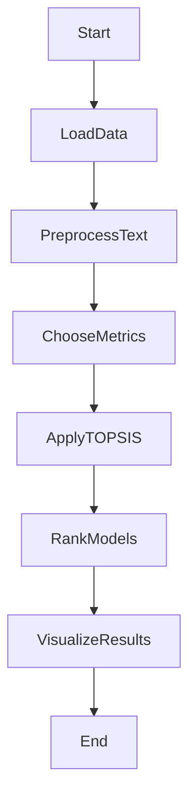

# Topsis-Pretrained-model-text-generation

# Text Summarization Model Comparison Project

## Overview

Text generation is a fundamental aspect of natural language processing, focusing on creating coherent and contextually relevant text based on input data. This project is dedicated to comparing different text generation models, guiding users in selecting the most suitable model for their specific text generation tasks.

## Key Features

### Metrics Considered

This comparison is centered around crucial metrics such as Rouge scores, generated text length, and latency. Rouge scores provide a measure of the quality of generated text, while the length of the generated text and latency offer insights into the model's output efficiency and response time.

### Methodology - TOPSIS

For an all-encompassing model comparison, we utilize the Technique for Order of Preference by Similarity to Ideal Solution (TOPSIS). This method evaluates models based on their closeness to the ideal solution and their distance from the least favorable solution, ensuring an equitable ranking system.

### Models Evaluated

The comparison involves prominent pre-trained models like GPT-2, GPT-3, BERT, Meta-LLaMa, and XLNet, which are widely recognized in the realm of text generation.

## Project Structure

- **`data.csv`**: CSV file containing evaluation metrics for each model.
- **`result.csv`**: CSV file presenting the ranked results in a tabular format.
- **`barchart.png`**: Bar chart depicting the comparative analysis of the models.

